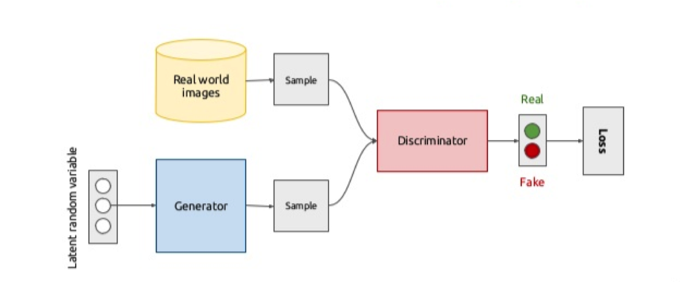
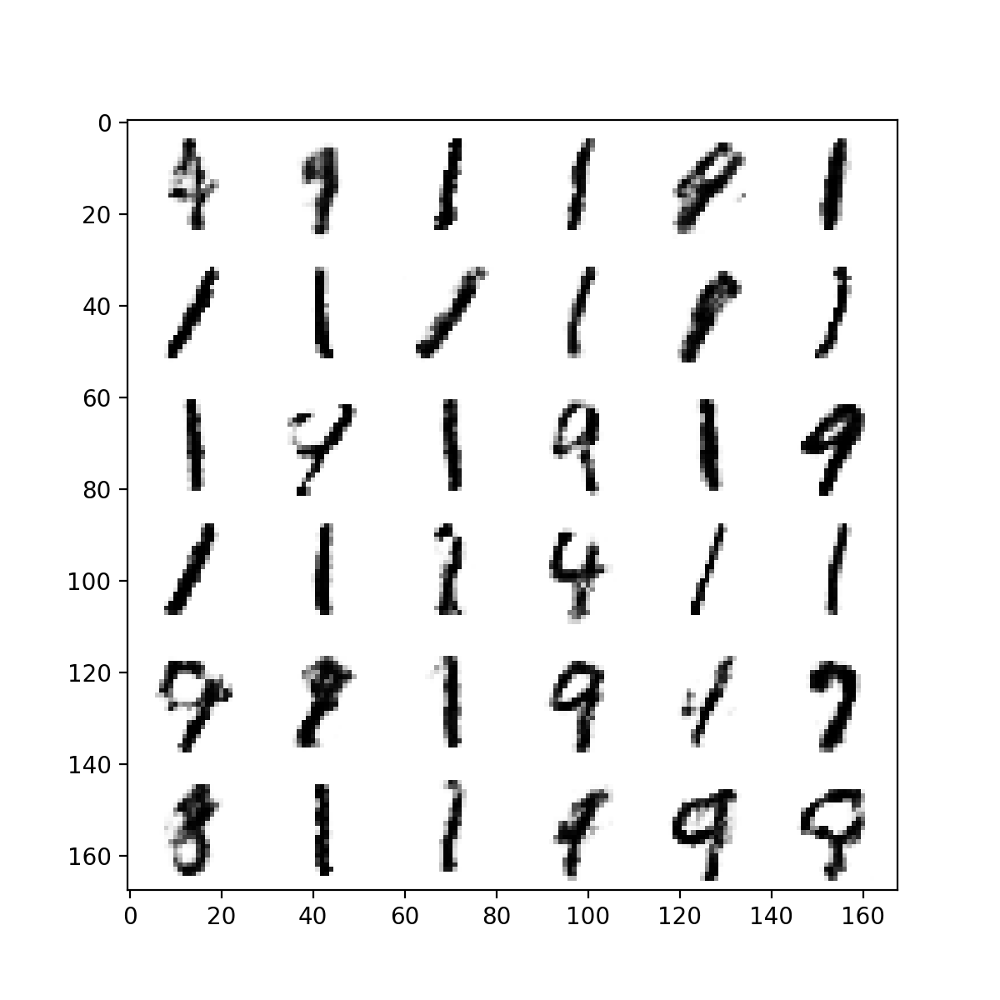
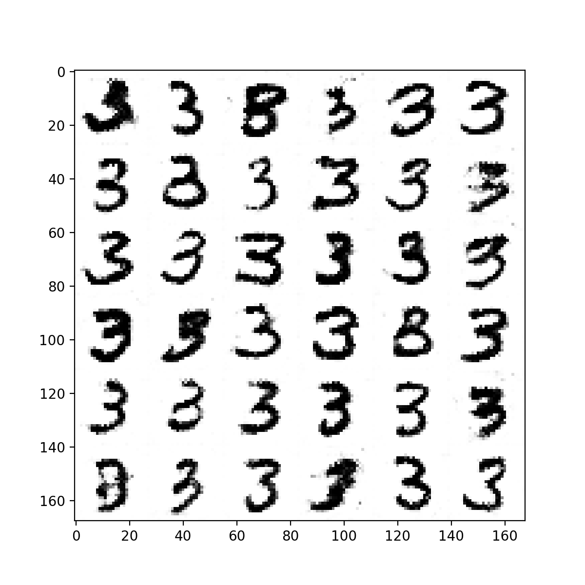
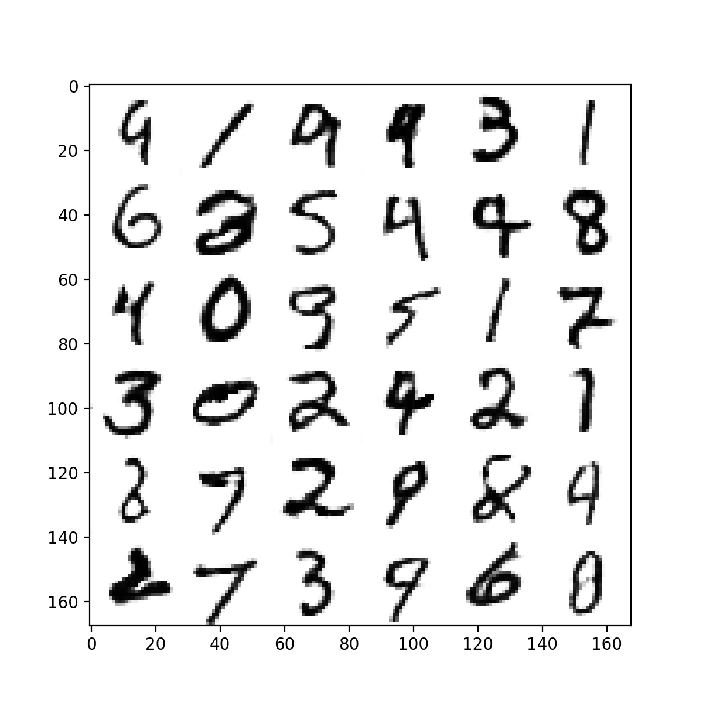

# Generative Adversarial Nets Example

The original codes are derived from [aymericdamien/TensorFlow-Examples](https://github.com/aymericdamien/TensorFlow-Examples), modifications and adjustments of the codes are made for easily understandable and more flexible.

### Generative Adversarial Network (GAN) Overview

[aymericdamien/TensorFlow-Examples/notebooks/3_NeuralNetworks/gan.ipynb](https://github.com/aymericdamien/TensorFlow-Examples/blob/master/notebooks/3_NeuralNetworks/gan.ipynb)

### Deep Convolutional Generative Adversarial Network (DCGAN) Overview

[aymericdamien/TensorFlow-Examples/notebooks/3_NeuralNetworks/dcgan.ipynb](https://github.com/aymericdamien/TensorFlow-Examples/blob/master/notebooks/3_NeuralNetworks/dcgan.ipynb)

### Results
**GAN Generated Results**:

**DCGAN Generated Results**:

**DCGAN with Batch Normalization Generated Results**:

**Note**: The trained models of _GAN_, _DCGAN_ as well as _DCGAN with Batch Normalization_ are available at the `data/ckpt` directory.

### Reference
- [Generative Adversarial Nets](https://arxiv.org/pdf/1406.2661.pdf)
- [Unsupervised representation learning with deep convolutional generative adversarial networks](https://arxiv.org/pdf/1511.06434)
- [Batch Normalization: Accelerating Deep Network Training by Reducing Internal Covariate Shift](https://arxiv.org/abs/1502.03167)
- [Understanding the difficulty of training deep feedforward neural networks](http://proceedings.mlr.press/v9/glorot10a.html)
- [Generative Adversarial Networks Explained](http://kvfrans.com/generative-adversial-networks-explained/)
- [aymericdamien/TensorFlow-Examples/notebooks/3_NeuralNetworks/gan.ipynb](https://github.com/aymericdamien/TensorFlow-Examples/blob/master/notebooks/3_NeuralNetworks/gan.ipynb)
- [aymericdamien/TensorFlow-Examples/notebooks/3_NeuralNetworks/dcgan.ipynb](https://github.com/aymericdamien/TensorFlow-Examples/blob/master/notebooks/3_NeuralNetworks/dcgan.ipynb)
- [nlintz/TensorFlow-Tutorials](https://github.com/nlintz/TensorFlow-Tutorials)
- [nlintz/TensorFlow-Tutorials: 11_gan.py](https://github.com/nlintz/TensorFlow-Tutorials/blob/master/11_gan.py)
- [MNIST Dataset](http://yann.lecun.com/exdb/mnist/)
- [andy's blog: An Explanation of Xavier Initialization](http://andyljones.tumblr.com/post/110998971763/an-explanation-of-xavier-initialization)
